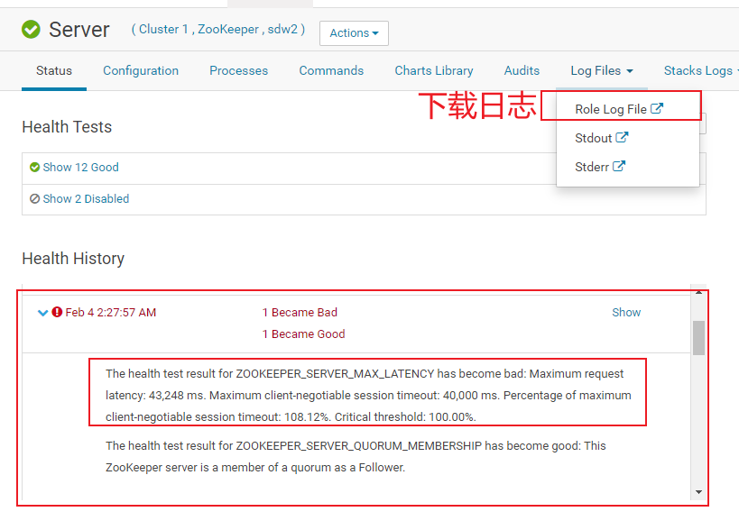
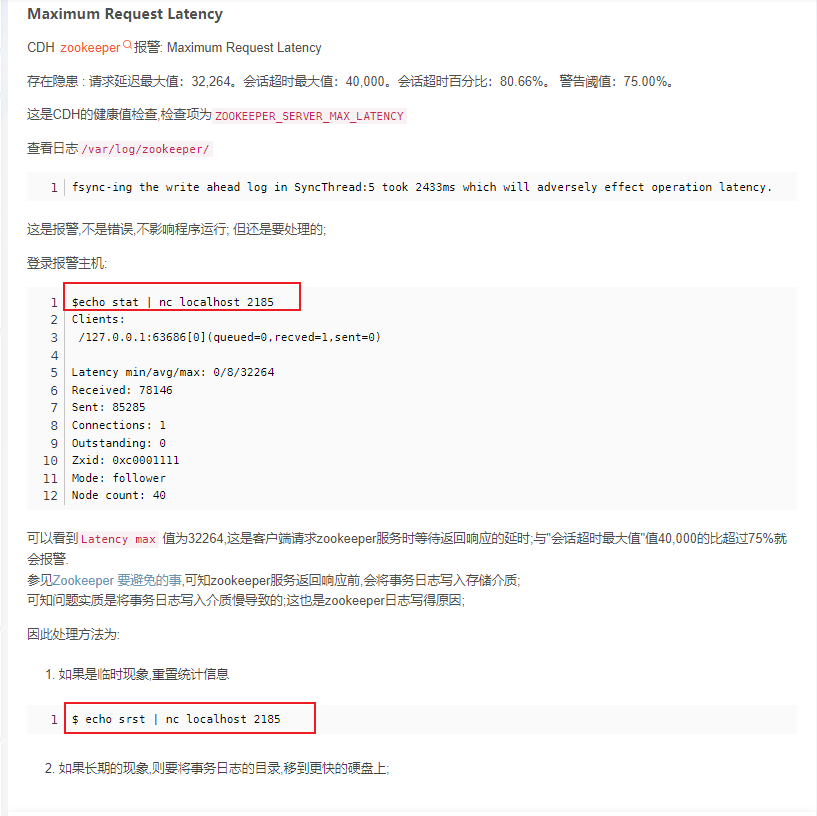
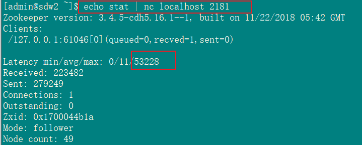
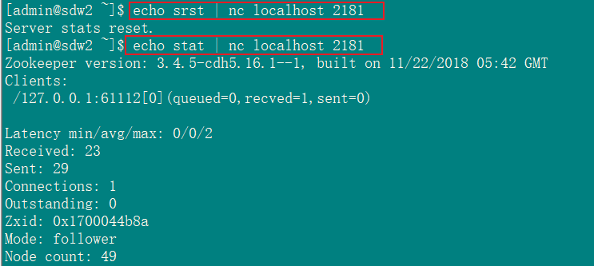

# 现象描述

这是CDH针对ZK的健康检查 2022年2月4日过年期间 生产环境CDH集群检查报警

# 最有效的处理方式
```
zk的Configuration中调大maxSessionTimeout配置 例如180000

```

# 处理方式
## 下载日志并查看日志
```
如上图所示下载该角色日志 并查看当时的日志 得到如下日志片段:
2022-02-04 02:26:25,911 INFO org.apache.zookeeper.server.NIOServerCnxn: Closed socket connection for client /192.168.54.7:21978 which had sessionid 0x27e9e3fe97e30ee
2022-02-04 02:27:44,842 WARN org.apache.zookeeper.server.persistence.FileTxnLog: fsync-ing the write ahead log in SyncThread:2 took 13956ms which will adversely effect operation latency. See the ZooKeeper troubleshooting guide
2022-02-04 02:28:30,896 INFO org.apache.zookeeper.server.NIOServerCnxnFactory: Accepted socket connection from /192.168.54.7:25054
可知是ZK的FileTxnLog类在写write ahead log到文件时 出现延迟
```
## 搜索相关博客
```
博客:https://blog.csdn.net/liangkiller/article/details/102805919中提到解决方案 如下图
```


## 查看生产服务器ZK统计信息
```
echo stat | nc localhost 2181
```


## 重置ZK统计信息
```
echo srst | nc localhost 2181
```


最终CDH上角色报错状态去除 如果后续经常出现该现象 考虑是不是磁盘读写性能跟不上或者考虑增大timeout的值
