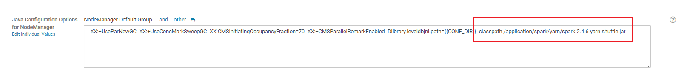
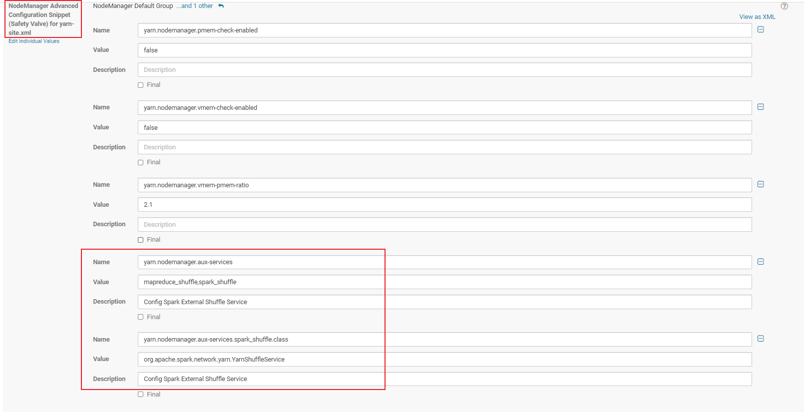

# Spark动态资源调度

## 文档
```
http://spark.apache.org/docs/2.4.6/job-scheduling.html
```


## 配置

```
以下就是翻译了http://spark.apache.org/docs/2.4.6/running-on-yarn.html#configuring-the-external-shuffle-service
1.自己编译Spark源码 在编译过程中指定yarn profile
2.定位到$SPARK_HOME/common/network-yarn/target/scala-<version>下的spark-<version>-yarn-shuffle.jar 
3.把spark-<version>-yarn-shuffle.jar加入到集群中所有的NodeManager的classpath下 
可以将jar包加入到HADOOP_CLASSPATH环境变量中
4.配置yarn-site.xml 增加如下配置
<property>
<name>yarn.nodemanager.aux-services</name>
<value>mapreduce_shuffle,spark_shuffle</value>
</property>

<property>
<name>yarn.nodemanager.aux-services.spark_shuffle.class</name>
<value>org.apache.spark.network.yarn.YarnShuffleService</value>
</property>
5.调大${HADOOP_HOME}/etc/hadoop/yarn-env.sh中的YARN_HEAPSIZE的值 该参数默认是注释的 默认值为1000 调大该参数可以避免shuffle过程中过多的垃圾回收
6.重启NodeManager


怎么找NodeManager的classpath？
1.通过ps -ef | grep nodemanager 找到进程的信息
2.进程的一大串信息中 找到-classpath 该参数后面的一堆就是classpath 比如我的classpath如下:
-classpath /home/admin/app/hadoop-2.6.0-cdh5.16.2/etc/hadoop:/home/admin/app/hadoop-2.6.0-cdh5.16.2/etc/hadoop:/home/admin/app/hadoop-2.6.0-cdh5.16.2/etc/hadoop:/home/admin/app/hadoop-2.6.0-cdh5.16.2/share/hadoop/common/lib/*:/home/admin/app/hadoop-2.6.0-cdh5.16.2/share/hadoop/common/*:/home/admin/app/hadoop-2.6.0-cdh5.16.2/share/hadoop/hdfs:/home/admin/app/hadoop-2.6.0-cdh5.16.2/share/hadoop/hdfs/lib/*:/home/admin/app/hadoop-2.6.0-cdh5.16.2/share/hadoop/hdfs/*:/home/admin/app/hadoop-2.6.0-cdh5.16.2/share/hadoop/yarn/lib/*:/home/admin/app/hadoop-2.6.0-cdh5.16.2/share/hadoop/yarn/*:/home/admin/app/hadoop-2.6.0-cdh5.16.2/share/hadoop/mapreduce/lib/*:/home/admin/app/hadoop-2.6.0-cdh5.16.2/share/hadoop/mapreduce/*:/home/admin/app/hive/lib/hive-exec-1.1.0-cdh5.16.2.jar::/home/admin/app/hadoop/contrib/capacity-scheduler/*.jar:/home/admin/app/hadoop/contrib/capacity-scheduler/*.jar:/home/admin/app/hadoop-2.6.0-cdh5.16.2/share/hadoop/yarn/*:/home/admin/app/hadoop-2.6.0-cdh5.16.2/share/hadoop/yarn/lib/*:/home/admin/app/hadoop-2.6.0-cdh5.16.2/etc/hadoop/nm-config/log4j.properties

网上博客通常建议放在:${HADOOP_HOME}/share/hadoop/yarn/lib下 
个人比较推荐的是放在一个放置公共lib的一个目录下 然后将该目录下的spark-<version>-yarn-shuffle.jar 加入到HADOOP_CLASSPATH环境变量中 这样jar包不会与Hadoop相关的jar混在一起 方便后续升级
```


## 启动spark-shell

```shell
#!/usr/bin/env bash


spark-shell \
--master yarn \
--name tianya_spark_shell \
--conf "spark.sql.shuffle.partitions=10" \
--conf "spark.dynamicAllocation.enabled=true" \
--conf "spark.shuffle.service.enabled=true"
```


## 启动spark-sql

```shell
#!/usr/bin/env bash

spark-sql \
--master yarn \
--name tianya_spark_sql \
--conf "spark.sql.shuffle.partitions=10" \
--conf "spark.dynamicAllocation.enabled=true" \
--conf "spark.shuffle.service.enabled=true"
```


## CDS2
```shell
如果是CDH上部署了spark2 参考:https://docs.cloudera.com/documentation/enterprise/5-16-x/topics/cdh_ig_running_spark_on_yarn.html
```

## 自己编译的Spark整合到CDH开启动态资源调度
```
1.参考文档:
https://spark.apache.org/docs/2.4.6/job-scheduling.html#configuration-and-setup
https://spark.apache.org/docs/2.4.6/running-on-yarn.html#configuring-the-external-shuffle-service
需要开启spark.dynamicAllocation.enabled为true 开启spark.shuffle.service.enabled为true

2.把spark-<version>-yarn-shuffle.jar加入到集群中所有的NodeManager的classpath下
测试环境的集群中，该jar包的路径为:/application/spark/yarn/spark-2.4.6-yarn-shuffle.jar
如何加入到NodeManager的classpath下:
CM Web UI 上,在YARN服务的Configuration中 找到Java Configuration Options for NodeManager配置项
在原有配置后面空一格 并添加-classpath /application/spark/yarn/spark-2.4.6-yarn-shuffle.jar

或者通过配置环境变量中的HADOOP_CLASSPATH
export HADOOP_CLASSPATH=${HADOOP_CLASSPATH}:/application/spark/yarn/spark-2.4.6-yarn-shuffle.jar

3.yarn-site.xml中配置yarn.nodemanager.aux-services和yarn.nodemanager.aux-services.spark_shuffle.class变量
如何配置:
CM Web UI 上,在YARN服务的Configuration中 找到NodeManager Advanced Configuration Snippet (Safety Valve) for yarn-site.xml
添加配置yarn.nodemanager.aux-services 值为mapreduce_shuffle,spark_shuffle 
添加配置yarn.nodemanager.aux-services.spark_shuffle.class 值为org.apache.spark.network.yarn.YarnShuffleService

4.适当增加NodeManager's heap size
如何配置:
CM Web UI 上,在YARN服务的Configuration中 找到Java Heap Size of NodeManager in Bytes
默认为1G 本测试环境暂时不添加 生产环境按需调大

5.重启NodeManager服务

6.启动应用并测试
spark-shell \
--master yarn \
--name tianya_spark_shell \
--conf "spark.sql.shuffle.partitions=10" \
--conf "spark.dynamicAllocation.enabled=true" \
--conf "spark.shuffle.service.enabled=true"

sc.textFile("hdfs:///tmp/tianyafu/tianyafu.txt").flatMap(_.split(",")).map((_,1)).reduceByKey(_+_).collect
```




